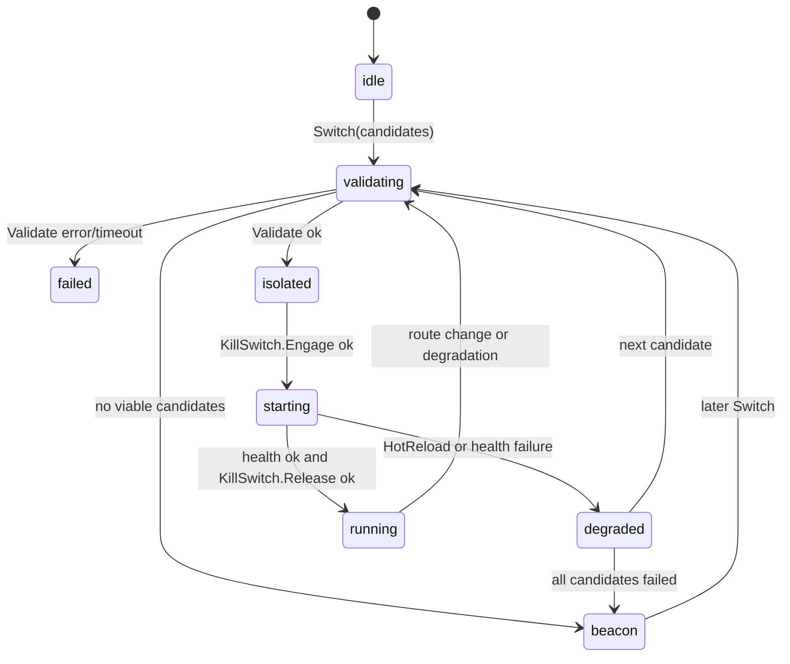
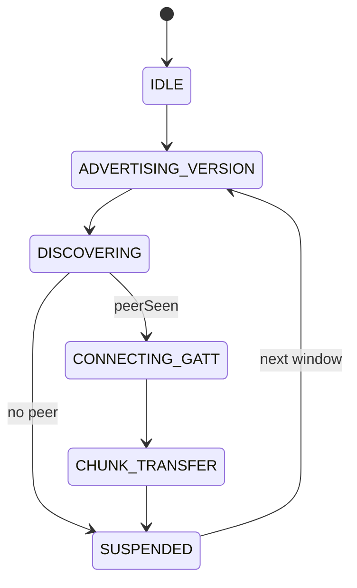

# SunLionet Architecture

SunLionet is an offline-first proxy configuration and runtime framework. The Inside client imports signed configuration bundles from untrusted media, verifies them locally, stores only encrypted state, renders vetted sing-box outbound templates, and controls the proxy runtime through a fail-closed Android VPN wrapper. The Outside side produces signed bundles, trust-state updates, QR/deep-link bootstrap payloads, and erasure-coded chunks for local distribution.

## System Boundaries

```mermaid
flowchart LR
  Outside["Outside distributor\nsigned bundles, trust updates, chunks"] --> Media["Untrusted media\nQR, BLE, Signal, file, SMS"]
  Media --> Importer["Inside importctl\nsignature, replay, revocation"]
  Importer --> Store["Encrypted local stores\nprofiles.enc, templates.enc, trust.enc, replay.enc"]
  Store --> Policy["Policy and failover engine"]
  Policy --> ProxyCore["ProxyCore abstraction"]
  ProxyCore --> SingBox["sing-box runtime"]
  SingBox --> VPN["Android VpnService\nfull-route TUN, tunnel-local DNS"]
  VPN --> Network["Network"]
```



The core rule is simple: transport layers may repair bytes, but only cryptographic verification grants trust. QR chunking, BLE checkpointing, and erasure coding never bypass Ed25519 bundle verification.

## Configuration Lifecycle

1. Outside generates canonical `bundle.BundlePayload` JSON and wraps it in a `BundleHeader`.
2. The header binds `Magic="SNB1"`, `BundleID`, `PublisherKeyID`, `Seq`, `Nonce`, timestamps, cipher, recipient, and signature.
3. The Ed25519 signature is computed over a domain-separated header copy plus ciphertext. Header `Signature` is empty during signing.
4. Inside receives bytes directly, `snb://v2:<base64url>`, or `SNBEC/1` erasure chunk lines.
5. `importctl.Importer` rejects untrusted signers, revoked signers, stale sequence numbers, nonce replay, invalid canonical payloads, and expired bundles.
6. Valid payloads update encrypted profile and template stores. Replay state commits only after storage succeeds.

## Offline Trust State

`pkg/importctl/revocation.go` implements an append-only trust state:

- `TrustUpdateMagic`: `SNB-TRUST-1`
- Signature domain: `SUNLIONET-TRUST-UPDATE-V1\x00`
- State seal domain: `SUNLIONET-TRUST-STATE-V1\x00`
- Default threshold: `2`
- Max update/state size: `256 KiB`
- Max trust update TTL: `30 days`

`TrustUpdateBlock` carries `Version`, `PrevStateHash`, `IssuedAt`, `EffectiveAt`, `ExpiresAt`, `Threshold`, operations, and root signatures. `ApplyBlock` requires strictly increasing version and exact previous hash, then verifies threshold root signatures before applying `add_signer`, `revoke_signer`, `retire_signer`, `add_root`, or `retire_root`.

## Network Failover State Machine

`pkg/proxycore` owns runtime selection. Implementations conform to:

```go
type ProxyCore interface {
    Name() string
    PID() int
    Validate(ctx context.Context, cfg CoreConfig) error
    Start(ctx context.Context, cfg CoreConfig) error
    HotReload(ctx context.Context, cfg CoreConfig) error
    Stop(ctx context.Context) error
    CheckHealth(ctx context.Context, cfg CoreConfig) (HealthSample, error)
}
```



`DefaultFailoverPolicy` sets validation timeout `5s`, health timeout `10s`, backoff base `500ms`, backoff max `8s`, max consecutive failures `2`, max TCP resets `3`, max TLS timeouts `2`, and max packet drop percent `40`. Failed all-candidate switches engage the kill switch and enter `beacon`.

## BLE Mesh State Machine

`pkg/mobilebridge/ble_mesh.go` defines sparse-gossip states and checkpointing:



BLE advertising payloads are exactly 22 bytes:

| Offset | Size | Field |
| --- | ---: | --- |
| 0 | 2 | ASCII `SM` |
| 2 | 1 | version `1` |
| 3 | 1 | reserved |
| 4 | 4 | little-endian 90-second epoch |
| 8 | 8 | HMAC-derived ephemeral peer ID |
| 16 | 6 | truncated config-version SHA-256 |

Checkpointing stores `TransferID`, `PayloadHashB64`, `TotalChunks`, `ChunkSize`, `Received[]`, and `UpdatedAtUnix`. Max BLE payload is `1 MiB`; default chunk size is `160 bytes`.

## Erasure Chunk Engine

`pkg/bundle/chunk_engine.go` repairs high-loss transports. It uses systematic Reed-Solomon-style Cauchy rows over GF(256). Given `N` data shards and `M` parity shards, any `N` valid chunks reconstruct the original bytes. The reconstructed bytes must still pass global Ed25519 bundle verification.

Binary chunk header:

| Field | Size |
| --- | ---: |
| Magic `SNCE` | 4 |
| Version `1` | 1 |
| Flags | 1 |
| BundleID = first 16 bytes of SHA-256(payload) | 16 |
| Index | 2 |
| DataShards | 2 |
| ParityShards | 2 |
| PayloadSize | 4 |
| ShardSize | 2 |
| PayloadSHA256 | 32 |
| ChunkSHA256 | 32 |
| Data | `ShardSize` |

Limits: `MaxChunkDataSize=64 KiB`, `MaxShardCount=255`, `DefaultMaxCacheByte=2 MiB`. Text form is `SNBEC/1 <base64url(binary)>`.

## Onboarding URI

`sunlionet://config/<base64url-envelope>` and `SL1:<payload>` carry short-lived bootstrap profiles. Payload text is capped at `300` base64url characters. Signed bytes use domain `SUNLIONET-ONBOARDING-V1\x00`; the envelope contains issued/expires seconds, family, port, signer public key, host/SNI, compact credentials, tag, and a 64-byte Ed25519 signature. The signer key must already be trusted.

## Android Wrapper

`pkg/mobile/android_wrapper.go` exports byte-oriented gomobile calls:

- `ConfigureAndroidRuntime(gcPercent, maxProcs, memoryLimitBytes)`
- `StartAgentBytes(config []byte) error`
- `ImportOnboardingURIWithConfigBytes(uri, config []byte) error`
- `GetStatusBytes() []byte`
- `RuntimeMemoryStatsJSON() string`
- `StartLocalPprof(addr string) error`

`Bridge.kt` caches reflected gomobile methods and uses byte arrays for startup/status/onboarding paths. Runtime defaults are `GOGC=75`, `GOMAXPROCS<=2`, and memory limit `96 MiB`. `StartLocalPprof` accepts loopback listeners only.

`SunlionetVpnService` routes `0.0.0.0/0` and `::/0`, sets tunnel-local DNS `10.0.0.1` and `fd00:736c:6e::1`, and enters `HOLDING` during network churn so ambient plaintext routes do not resume while the proxy core restarts.

## Telemetry

`pkg/telemetry` is disabled by default. When explicitly enabled, it stores enum-only events, batches for 24-72 hours, adds small counter noise, encrypts each batch with fresh X25519/HKDF/ChaCha20-Poly1305, and refuses direct production endpoints. Queue cap is `50 KiB` and over-budget queues self-destruct.

## Extension Guide: New Proxy Backend

1. Implement `ProxyCore`.
2. Ensure `Validate` is side-effect free and respects context cancellation.
3. Ensure `HotReload` never writes plaintext traffic before the kill switch is engaged by `Engine.Switch`.
4. Return passive `HealthSample` values when possible. Do not create active probes that are fingerprintable unless explicitly configured.
5. Keep runtime-owned goroutines bounded. Every goroutine must exit on context cancellation or `Stop`.
6. Do not bypass `SunlionetVpnService`; all Android traffic must remain inside the TUN route.
7. Add chaos coverage under `tests/chaos` for failure, timeout, degradation, and kill-switch leakage.

## Concurrency Guardrails

- Do not hold mutexes while performing network I/O or blocking process waits.
- Buffered channels used for health signals must drop when full rather than block critical loops.
- All public state machines must expose context-cancelable methods.
- Replay/trust/profile stores use atomic temp-file then rename semantics.
- Race-sensitive changes must pass `go test ./...` and Linux `go test -race ./tests/chaos`.

## Related Specifications

- [Config ingestion audit](docs/security/config-ingestion-audit.md)
- [Offline trust state machine](docs/security/offline-trust-state-machine.md)
- [Onboarding URI](docs/security/onboarding-uri.md)
- [Erasure-coded chunks](docs/security/erasure-coded-chunks.md)
- [Zero-knowledge telemetry](docs/security/zero-knowledge-telemetry.md)
- [Android memory/VPN boundary](docs/security/android-memory-vpn-boundary.md)
- [Chaos strategy matrix](docs/testing/chaos-strategy-matrix.md)
